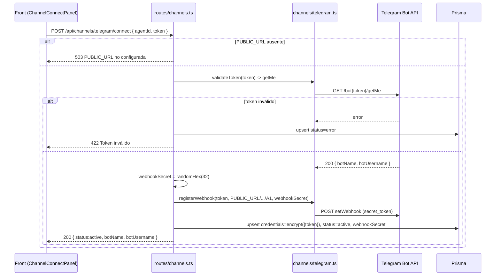
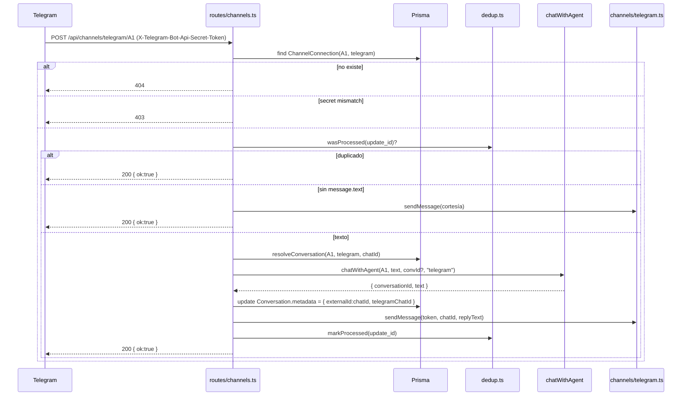
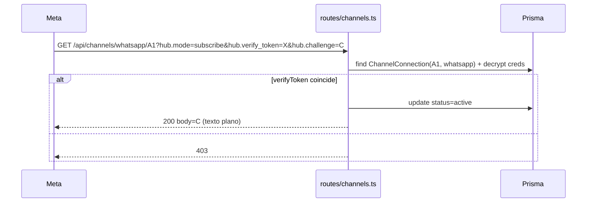
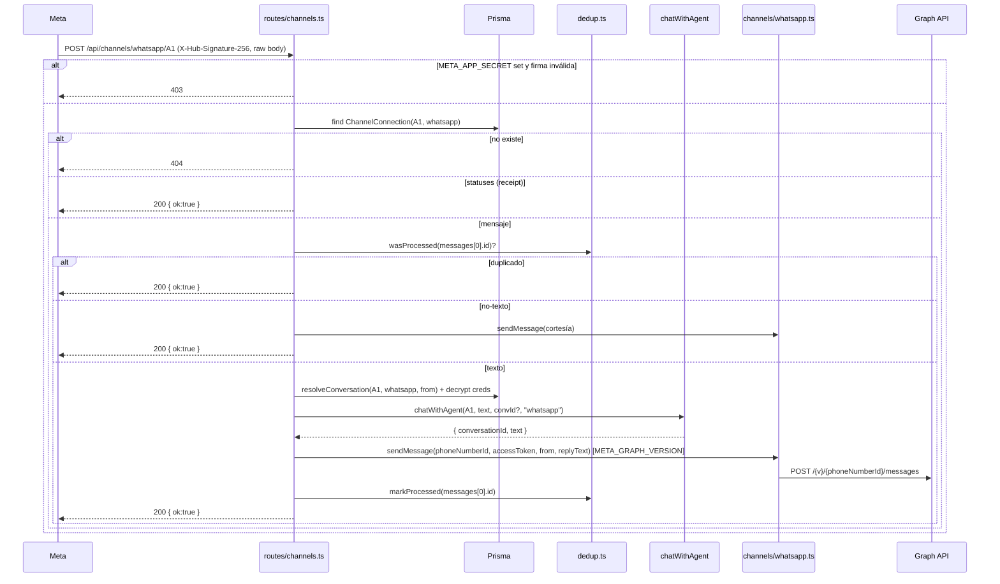

# Design — telegram-whatsapp-bots

Canal objetivo: **telegram / whatsapp**
Fecha: 2026-06-12
Estado: design-ready
Fuente: `proposal.md` + `spec.md` (spec-ready) + código real del repo.

---

## 0. Decisiones de arquitectura (ADR resumido)

| ID | Decisión | Alternativa rechazada | Razón |
|---|---|---|---|
| AD1 | Modelo `ChannelConnection` separado de `Integration` | Reutilizar `Integration` con `provider in (telegram,whatsapp)` | `Integration` modela OAuth (accessToken/refreshToken/expiresAt). Canales de mensajería tienen credenciales heterogéneas (token único Telegram vs. triplete WhatsApp) y `webhookSecret`. Separar respeta SRP y evita columnas nullables mezcladas. |
| AD2 | Router Express dedicado `back/src/routes/channels.ts` montado en `index.ts` | Añadir rutas inline en `index.ts` | `index.ts` ya tiene **707 líneas (> 500)**. Convención del repo: archivos < 500 líneas. El bloque de canales (8 endpoints + validaciones) crecería el archivo otras ~250 líneas. Se extrae a router. |
| AD3 | Lógica de proveedor en `back/src/lib/channels/{telegram,whatsapp}.ts`; crypto en `back/src/lib/crypto.ts` | Todo dentro del router | Las rutas orquestan; los clientes HTTP y parsers son reutilizables y testeables en aislamiento (sin Express). Espeja el patrón existente `lib/integrations/oauth.ts`. |
| AD4 | Dedup de `update_id` / `message.id` en **memoria con TTL** (`Map<string, number>`), sin tabla DB | Tabla `ProcessedUpdate` | Spec R2-2/R4-2 lo deja a diseño (D2). Volumen bajo, ventana corta (24 h). Una tabla añade migración, índice y limpieza. El coste de un reproceso aislado tras reinicio (ventana perdida) es 1 mensaje duplicado raro; aceptable. Documentado como tradeoff. |
| AD5 | Reutilizar `chatWithAgent(agentId, message, conversationId?, channel?)` sin tocar su firma | Crear pipeline paralelo | La firma ya soporta `channel` (engine.ts:106-110). Solo falta resolver `conversationId` a partir del id de chat externo (ver §5). |
| AD6 | Validación `X-Hub-Signature-256` **condicional** a `META_APP_SECRET` | Obligatoria siempre | Spec R7-3 (D3): si no hay App Secret, se omite con log de warning. Permite onboarding sin App Secret pero recomienda configurarlo. |
| AD7 | Versión Graph API por env `META_GRAPH_VERSION`, default **v21.0** | Hardcode v18.0 | Decisión D4 confirmada en contexto de orquestación. **DISCREPANCIA con spec** (spec dice v18.0): el spec se considera no normativo en este punto concreto; se parametriza y default v21.0. |
| AD8 | Variable de URL pública nueva `PUBLIC_URL` | Reutilizar `BACK_URL` de oauth.ts | `BACK_URL` default `localhost` no es accesible por Telegram/Meta. Webhooks exigen HTTPS público; semánticamente distinto. Se mantiene `BACK_URL` para OAuth y se añade `PUBLIC_URL` para webhooks. |

---

## 1. Arquitectura de módulos backend

```
back/src/
  index.ts                       # monta router: app.use("/api/channels", channelsRouter)
  routes/
    channels.ts                  # 8 endpoints REST (orquestación, validación, persistencia)
  lib/
    crypto.ts                    # encrypt/decrypt AES-256-GCM (reutilizable)
    channels/
      telegram.ts                # cliente Telegram + handleTelegramUpdate
      whatsapp.ts                # cliente WhatsApp + handleWhatsappEvent + verifyWebhook
      dedup.ts                   # Map TTL para idempotencia (compartido)
      types.ts                   # tipos de payload Telegram/WhatsApp + credenciales
    agent/engine.ts              # SIN CAMBIOS — chatWithAgent ya expone `channel`
```

Responsabilidades (SRP):

- **`crypto.ts`** — sin dependencias del dominio. `encrypt(plain: string): EncryptedPayload` / `decrypt(payload): string`. No conoce `ChannelConnection`.
- **`channels/telegram.ts`** — wrappers HTTP de la Bot API + `handleTelegramUpdate`. No habla con Express ni con Prisma directamente para resolver credenciales (recibe el token ya descifrado).
- **`channels/whatsapp.ts`** — wrappers Graph API + `verifyWebhook` + `handleWhatsappEvent`.
- **`channels/dedup.ts`** — `wasProcessed(key): boolean` / `markProcessed(key)`. TTL 24 h, limpieza perezosa.
- **`routes/channels.ts`** — única capa que toca Prisma (`ChannelConnection`), llama crypto para cifrar/descifrar, y orquesta los clientes. Resuelve `conversationId` (§5).

`index.ts` solo añade:

```ts
import { channelsRouter } from "@/routes/channels";
app.use("/api/channels", channelsRouter);
```

> Nota express body parser: el receptor WhatsApp POST necesita el **raw body** para validar HMAC `X-Hub-Signature-256`. El router debe capturar el raw buffer (middleware `express.json({ verify })`) en las rutas de canales antes de parsear, o montar un `express.raw()` específico en `/api/channels/whatsapp/:agentId`. Ver §8 (riesgo).

---

## 2. Modelo Prisma `ChannelConnection`

```prisma
model ChannelConnection {
  id            String   @id @default(cuid())
  agent         Agent    @relation(fields: [agentId], references: [id], onDelete: Cascade)
  agentId       String
  provider      String   // telegram | whatsapp
  credentials   Json     // ciphertext AES-256-GCM: { iv, authTag, data } — NUNCA texto plano
  status        String   @default("pending") // pending | active | error
  webhookSecret String?  // Telegram: secret_token del setWebhook (≥32 bytes hex)
  createdAt     DateTime @default(now())
  updatedAt     DateTime @updatedAt

  @@unique([agentId, provider])
}
```

Relación inversa en `Agent` (schema.prisma:29-53, añadir tras `integrations`):

```prisma
  channelConnections ChannelConnection[]
```

**SQL de migración** — `back/prisma/migrate-channel-connection.sql` (no destructiva, solo CREATE):

```sql
-- migrate-channel-connection.sql
-- Rollback: DROP TABLE "ChannelConnection";

CREATE TABLE "ChannelConnection" (
  "id"            TEXT NOT NULL,
  "agentId"       TEXT NOT NULL,
  "provider"      TEXT NOT NULL,
  "credentials"   JSONB NOT NULL,
  "status"        TEXT NOT NULL DEFAULT 'pending',
  "webhookSecret" TEXT,
  "createdAt"     TIMESTAMP(3) NOT NULL DEFAULT CURRENT_TIMESTAMP,
  "updatedAt"     TIMESTAMP(3) NOT NULL,
  CONSTRAINT "ChannelConnection_pkey" PRIMARY KEY ("id")
);

CREATE UNIQUE INDEX "ChannelConnection_agentId_provider_key"
  ON "ChannelConnection" ("agentId", "provider");

ALTER TABLE "ChannelConnection"
  ADD CONSTRAINT "ChannelConnection_agentId_fkey"
  FOREIGN KEY ("agentId") REFERENCES "Agent"("id")
  ON DELETE CASCADE ON UPDATE CASCADE;
```

Aplicación: editar `schema.prisma`, ejecutar la SQL manual (convención del repo: `migrate-*.sql`) y `prisma generate` para regenerar el cliente en `src/lib/generated/prisma`.

---

## 3. Estructura del ciphertext (crypto.ts)

```ts
// AES-256-GCM. Clave: env CHANNEL_ENCRYPTION_KEY (32 bytes, hex de 64 chars o base64).
export interface EncryptedPayload {
  iv: string;      // hex, 12 bytes (96 bits, recomendado GCM)
  authTag: string; // hex, 16 bytes
  data: string;    // hex, ciphertext
}

export function encrypt(plain: string): EncryptedPayload;
export function decrypt(payload: EncryptedPayload): string;
```

- Al arranque: si `CHANNEL_ENCRYPTION_KEY` ausente o longitud != 32 bytes → log de error de configuración (spec R5-4). No se aborta el proceso (otras rutas siguen vivas), pero cualquier connect devuelve **500 `{ error: "Configuración de cifrado incompleta" }`**.
- El objeto de credenciales se serializa a JSON antes de cifrar: Telegram `{ token }`; WhatsApp `{ phoneNumberId, accessToken, verifyToken }`. Se persiste `encrypt(JSON.stringify(creds))` en `credentials`.

---

## 4. Contratos API REST

Base: `/api/channels`. Todas las respuestas JSON salvo el GET de verificación WhatsApp (texto plano).

### 4.1 `POST /api/channels/:provider/connect`

Telegram request:
```json
{ "agentId": "A1", "token": "123456:ABC-DEF..." }
```
WhatsApp request:
```json
{ "agentId": "A1", "phoneNumberId": "10987...", "accessToken": "EAAG...", "verifyToken": "mi-token-secreto" }
```

Telegram response 200:
```json
{ "status": "active", "botName": "Soporte Bot", "botUsername": "soporte_bot" }
```
WhatsApp response 200:
```json
{ "status": "pending", "webhookUrl": "https://api.ejemplo.com/api/channels/whatsapp/A1" }
```

Errores: `409` unique (R0-1) · `422 { error: "Token de Telegram inválido" }` (R1-2) · `503 { error: "PUBLIC_URL no configurada; el backend no es accesible públicamente" }` (R1-3, solo Telegram) · `500 { error: "Configuración de cifrado incompleta" }` (R5-4) · `502` error de red (CB-4).

### 4.2 `GET /api/channels/:agentId`

Estado de las conexiones del agente, **sin credenciales** (R5-3).
```json
{
  "publicUrlConfigured": true,
  "connections": [
    { "provider": "telegram", "status": "active", "botUsername": "soporte_bot" },
    { "provider": "whatsapp", "status": "pending", "phoneNumberIdMasked": "****7654",
      "webhookUrl": "https://api.ejemplo.com/api/channels/whatsapp/A1" }
  ]
}
```
`botUsername`/`botName` y `phoneNumberIdMasked` derivan de metadata almacenada al conectar (no del ciphertext en caliente). El token y el accessToken nunca se devuelven.

### 4.3 `DELETE /api/channels/:provider/:agentId`

Telegram: llama `deleteWebhook`, borra fila. WhatsApp: borra fila (sin llamada externa, R3-4).
```json
{ "status": "disconnected" }
```
`404` si no existe la conexión.

### 4.4 `POST /api/channels/telegram/:agentId` (webhook receptor)

Header obligatorio `X-Telegram-Bot-Api-Secret-Token` == `webhookSecret`.
- Mismatch/ausente → `403`, sin lógica (R2-4, R7-1).
- Sin `ChannelConnection` → `404` (R2-5, R7-4).
- Update sin `message.text` → mensaje de cortesía + `200 { ok: true }` (R2-3).
- Duplicado por `update_id` → `200 { ok: true }`, sin reprocesar (R2-2).
- OK → `chatWithAgent` + `sendMessage`, `200 { ok: true }` (R2-1).

Siempre `200` ante updates válidos (Telegram reintenta en !=2xx).

### 4.5 `GET /api/channels/whatsapp/:agentId` (verificación Meta)

Query: `hub.mode=subscribe&hub.verify_token=...&hub.challenge=...`.
- `verify_token` coincide → `status=active`, responde **`200` con body = `hub.challenge` en texto plano** (R3-2).
- No coincide → `403` (R3-3, R7-2).

### 4.6 `POST /api/channels/whatsapp/:agentId` (webhook receptor)

- Si `META_APP_SECRET` definido y `X-Hub-Signature-256` no valida HMAC del raw body → `403` (R7-3). Si no está definido → warning en log, continúa.
- Sin `ChannelConnection` → `404` (R7-4).
- `statuses` (delivery/read) → ignorar, `200 { ok: true }` (R4-4).
- Mensaje no-texto → cortesía + `200` (R4-3).
- Duplicado por `messages[0].id` → `200`, sin reprocesar (R4-2).
- Texto → `chatWithAgent` + Graph API `sendMessage`, `200 { ok: true }` (R4-1).

---

## 5. Integración con el pipeline de chat (mapeo conversación ↔ chat externo)

Función reutilizada (verificada en código): **`chatWithAgent(agentId, userMessage, conversationId?, channel = "widget")`** en `back/src/lib/agent/engine.ts:106`. Crea `Conversation` si no se pasa `conversationId`, persiste mensajes y devuelve `{ conversationId, text, toolCalls }`.

Problema: el pipeline identifica conversaciones por `conversationId` interno (cuid), pero Telegram/WhatsApp identifican el hilo por `chatId` / `from` (teléfono). Hay que mapear **id externo → Conversation**.

Estrategia (sin cambiar la firma de `chatWithAgent`): el router resuelve el `conversationId` antes de llamar, buscando una `Conversation` previa por `agentId` + `channel` + el id externo en `metadata`:

```ts
// resolveConversation(agentId, channel, externalKey, metaPatch)
const existing = await prisma.conversation.findFirst({
  where: {
    agentId,
    channel,                         // "telegram" | "whatsapp"
    metadata: { path: ["externalId"], equals: externalKey },
  },
  orderBy: { createdAt: "desc" },
});
const conversationId = existing?.id; // si undefined, chatWithAgent crea una nueva
const reply = await chatWithAgent(agentId, text, conversationId, channel);
```

- `externalKey`: Telegram = `String(message.chat.id)`; WhatsApp = `from` (teléfono E.164).
- Cuando `chatWithAgent` crea la conversación (caso `conversationId` undefined), crea con `channel` pero **sin** `metadata.externalId`. Por eso, tras la primera respuesta el router hace un `prisma.conversation.update` para fijar `metadata = { externalId, telegramChatId | waFrom }`. Así la segunda llamada del mismo chat la encuentra.
- Spec usa `metadata={ telegramChatId }` / `{ waFrom }`. Se añade además `externalId` (clave canónica de búsqueda) para una query única e indexable por path JSON.

> Alternativa rechazada: pasar `chatId` como `conversationId`. Rompería `findUniqueOrThrow` (engine.ts:113) que espera un cuid existente.

---

## 6. Frontend — pestaña Integraciones

Componente nuevo **`front/components/ChannelConnectPanel.tsx`**, renderizado dentro de la pestaña `integraciones` de `app/agents/[id]/page.tsx`, **solo si** `agent.channel` es `telegram` o `whatsapp` (CB-3). Convive con `IntegrationsPanel` (OAuth).

Props:
```ts
interface ChannelConnectPanelProps {
  agentId: string;
  channel: "telegram" | "whatsapp";
  onChange: () => void; // recarga el agente tras connect/disconnect
}
```

Estado interno (cargado de `GET /api/channels/:agentId`):
```ts
type ChannelStatus = "disconnected" | "pending" | "active" | "error" | "loading";
```

Mapa estado → UI (spec R6):
- `disconnected` (R6-1): card con formulario. Telegram = campo "Token de BotFather" + instrucciones @BotFather. WhatsApp = `phoneNumberId`, `accessToken`, `verifyToken` + instrucciones Meta. Botón "Conectar".
- `loading` (R6-2): spinner, formulario y botón deshabilitados durante el POST.
- `active` (R6-3): badge verde, muestra `botUsername` (Telegram) o `phoneNumberIdMasked` (WhatsApp). Botón "Desconectar" (con confirmación, R6-6).
- `pending` (R6-4, WhatsApp): "Pendiente de verificación", muestra `webhookUrl` copiable + pasos de verificación en Meta.
- `error` (R6-5): badge rojo, reabre formulario para reintentar.
- Si `publicUrlConfigured === false` (R6-7): aviso "El backend no tiene PUBLIC_URL configurada…", botón "Conectar" deshabilitado.

Helpers en `front/lib/api.ts` (reusa `api()` existente; nota: `api()` siempre hace `.json()`, sirve para estos endpoints JSON):
```ts
// connectChannel(provider, body) -> POST /api/channels/:provider/connect
// channelStatus(agentId)         -> GET  /api/channels/:agentId
// disconnectChannel(provider, agentId) -> DELETE /api/channels/:provider/:agentId
```
Tras connect/disconnect → `onChange()`; el panel actualiza estado sin recargar página (R6-6).

---

## 7. Variables de entorno nuevas (`back/.env.example`)

| Variable | Requerida | Default | Propósito |
|---|---|---|---|
| `CHANNEL_ENCRYPTION_KEY` | Sí | — | Clave AES-256 (32 bytes). Documentar: rotarla invalida todas las credenciales → reconectar canales (CB-1). |
| `PUBLIC_URL` | Sí para conectar | — | URL HTTPS pública del backend para webhooks. Local: ngrok/cloudflared (CB-2). |
| `META_APP_SECRET` | Opcional | — | Si presente, valida `X-Hub-Signature-256` (R7-3). Si ausente, warning en log. |
| `META_GRAPH_VERSION` | No | `v21.0` | Versión de la Graph API de Meta (AD7). |

> DISCREPANCIA de nomenclatura: el contexto de orquestación mencionaba `CREDENTIALS_KEY`, pero el **spec normativo** fija `CHANNEL_ENCRYPTION_KEY`. Se respeta el spec.

---

## 8. Secuencias

### 8.1 Conexión Telegram



### 8.2 Mensaje entrante Telegram



### 8.3 Verificación webhook WhatsApp



### 8.4 Mensaje entrante WhatsApp



---

## 9. Estrategia de tests

Framework: Vitest (back, ya en uso) + Playwright (front, ya en uso).

### Unit (back)
- **crypto.ts**: round-trip `decrypt(encrypt(x)) === x`; `iv` distinto en dos cifrados del mismo plaintext; `decrypt` con `authTag` manipulado lanza; `encrypt` con clave de longitud incorrecta lanza/error de config.
- **telegram.ts parsers**: extracción de `chatId` y `text` de un update real; update con foto/sticker → sin texto (rama cortesía); update sin `message` → ignorado.
- **whatsapp.ts parsers**: `verifyWebhook` (match/no-match del verify token → challenge/null); parseo de payload `messages` texto, parseo `statuses` (receipt → ignore), mensaje `image` → no-texto.
- **dedup.ts**: `markProcessed` + `wasProcessed` true; expiración tras TTL (inyectar reloj/`Date.now` mockeable); claves distintas independientes.
- **firma HMAC WhatsApp**: dado un raw body y `META_APP_SECRET`, `X-Hub-Signature-256` válida pasa, alterada falla.

### Mock de APIs externas
- Telegram (`api.telegram.org`) y Meta (`graph.facebook.com`) se mockean con `vi.fn()` sobre `fetch` global (los clientes usan `fetch`, sin SDK). Helper `mockFetchOnce({ ok, json })`.
- Casos: `getMe` 200 vs error; `setWebhook` ok; `sendMessage` ok vs 5xx (CB-4 → status=error, 502).
- Prisma: usar la instancia de test del repo o mock de `prisma.channelConnection` / `prisma.conversation`. Verificar que `credentials` persistido es ciphertext (nunca contiene el token plano).

### Integración / e2e
- Playwright (front): render del `ChannelConnectPanel` en estados disconnected/active/pending/error; flujo de "Conectar" con backend mockeado (route interception); aviso cuando `publicUrlConfigured=false` deshabilita "Conectar".
- Gate de cierre (tasks 7.4): `cd back && npm test` y `cd front && npm run build` en verde.

---

## 10. Riesgos / cuestiones abiertas para implementación

1. **Raw body para HMAC**: el `app.use(express.json())` global de `index.ts` consume el body antes del router. Necesario montar parser que preserve raw buffer **solo** en `/api/channels/whatsapp/:agentId` POST, o usar `express.json({ verify: (req,_res,buf)=>{ req.rawBody = buf } })`. Resolver en implementación; no romper el resto de rutas.
2. **Discrepancia de versión Graph API**: spec dice v18.0, decisión de proyecto v21.0. Parametrizado por env; default v21.0. Confirmar con humano si el spec debe actualizarse.
3. **Discrepancia de nombre de env**: contexto mencionó `CREDENTIALS_KEY`; spec normativo `CHANNEL_ENCRYPTION_KEY`. Se usa el del spec.
4. **Dedup en memoria** se pierde al reiniciar el proceso (ventana de duplicado tras restart). Tradeoff aceptado (AD4); si en producción se observan duplicados, promover a tabla `ProcessedUpdate`.
5. **Rotación de clave** (CB-1) no automatizada; documentar en `.env.example`.
6. **WhatsApp `pending` permanente**: si Meta nunca llama al GET de verificación, la conexión queda en `pending`. La UI lo refleja (R6-4); no hay timeout automático en esta fase.
